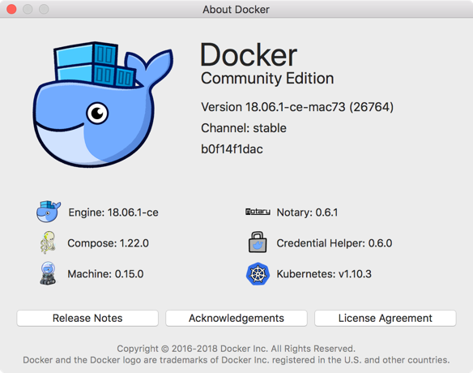
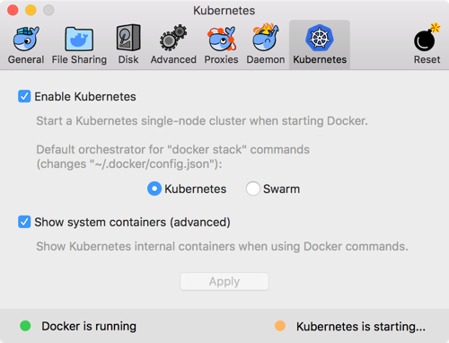
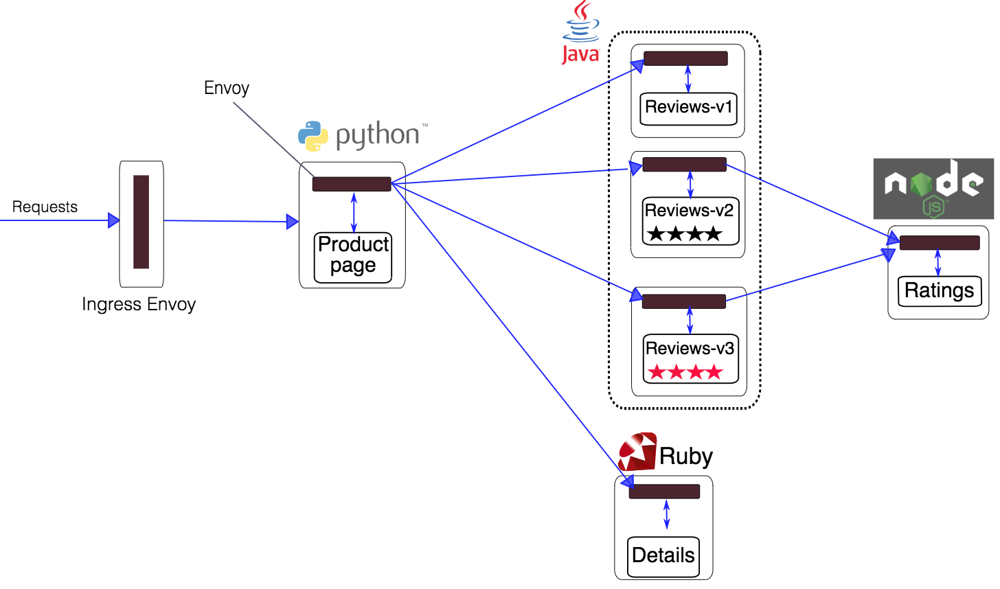
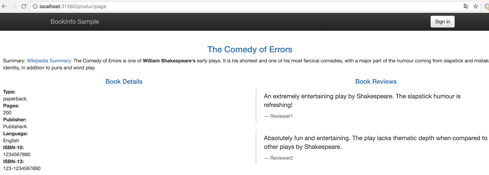

# 1. Docker for Mac安装istio

我们一起学喵叫，一起喵...... 不对，我们一起学 istio，从今天起，我们将推出一起学 istio 的系列课程，和大家一起学习热门的 Servie Mesh 技术：istio，今天第一篇内容：在 Docker for Mac 上面安装 istio。

## 安装 docker 和 k8s


我这里安装的是 Stable 版本，最新的稳定版本之中也自带了 Kubernetes，之前的版本中需要 Edge 版本才行。

docker for mac 安装完成后，直接通过下面的界面启用 Kubernetes 即可安装上 Kubernetes:



由于安装过程中需要拉取一系列镜像，所以可能需要花费几分钟时间，当右下角出现标识 kubernetes is running 时则证明安装成功了。 

当前版本安装的 Kubernetes 版本是 v1.10.3，涉及到的一些镜像如下：
```shell
$ docker images |grep k8s
k8s.gcr.io/kubernetes-dashboard-amd64      v1.10.0             0dab2435c100        3 weeks ago         122MB
k8s.gcr.io/kube-proxy-amd64                v1.10.3             4261d315109d        4 months ago        97.1MB
k8s.gcr.io/kube-apiserver-amd64            v1.10.3             e03746fe22c3        4 months ago        225MB
k8s.gcr.io/kube-controller-manager-amd64   v1.10.3             40c8d10b2d11        4 months ago        148MB
k8s.gcr.io/kube-scheduler-amd64            v1.10.3             353b8f1d102e        4 months ago        50.4MB
k8s.gcr.io/etcd-amd64                      3.1.12              52920ad46f5b        6 months ago        193MB
k8s.gcr.io/k8s-dns-dnsmasq-nanny-amd64     1.14.8              c2ce1ffb51ed        8 months ago        41MB
k8s.gcr.io/k8s-dns-sidecar-amd64           1.14.8              6f7f2dc7fab5        8 months ago        42.2MB
k8s.gcr.io/k8s-dns-kube-dns-amd64          1.14.8              80cc5ea4b547        8 months ago        50.5MB
k8s.gcr.io/pause-amd64                     3.1                 da86e6ba6ca1        9 months ago        742kB
```

我们可以看到上述使用的到的镜像默认会去 gcr.io 的镜像仓库中拉取，所以如果没有科学上网的同学要么自己配置一个科学上网的工具，要么提前在 docker hub 上面或者阿里云上面搜索上面的镜像，手动拉取到本地，然后重新打上上面的 tag 即可。

另外，由于安装 istio 需要用到的资源较多，建议增大 CPU 和内存的使用限制：


> 如果你本子内存本身就非常低，还是建议在虚拟机当中进行测试，不然会把你 mac 电脑卡爆的。


## 安装 kubectl
Kubernetes 集群启用成功了，现在要去操作该集群的话就得安装一个 kubectl 工具，可以直接下载 kubectl 的二进制文件到本地直接使用，我们这里使用 Mac 上安装软件的常用工具 Homebrew：
```shell
$ brew install kubernetes-cli
...
$ kubectl version
Client Version: version.Info{Major:"1", Minor:"10", GitVersion:"v1.10.3", GitCommit:"2bba0127d85d5a46ab4b778548be28623b32d0b0", GitTreeState:"clean", BuildDate:"2018-05-21T09:17:39Z", GoVersion:"go1.9.3", Compiler:"gc", Platform:"darwin/amd64"}
Server Version: version.Info{Major:"1", Minor:"10", GitVersion:"v1.10.3", GitCommit:"2bba0127d85d5a46ab4b778548be28623b32d0b0", GitTreeState:"clean", BuildDate:"2018-05-21T09:05:37Z", GoVersion:"go1.9.3", Compiler:"gc", Platform:"linux/amd64"}
```

注意 docker for mac 的 k8s 的 context 是 docker-for-desktop，如果目前已有其他集群环境，需要使用如下命令进行切换：
```shell
$ kubectl config use-context docker-for-desktop
```

kubectl 工具安装配置完成后，执行命令验证下是否可以正常操作集群：
```shell
$ kubectl get nodes
NAME                 STATUS    ROLES     AGE       VERSION
docker-for-desktop   Ready     master    3d        v1.10.3
$ kubectl get pods -n kube-system
NAME                                         READY     STATUS    RESTARTS   AGE
etcd-docker-for-desktop                      1/1       Running   0          3d
kube-apiserver-docker-for-desktop            1/1       Running   0          3d
kube-controller-manager-docker-for-desktop   1/1       Running   0          3d
kube-dns-86f4d74b45-ht885                    3/3       Running   1          3d
kube-proxy-x7fnp                             1/1       Running   0          3d
kube-scheduler-docker-for-desktop            1/1       Running   0          3d
kubernetes-dashboard-7b9c7bc8c9-pmg97        1/1       Running   1          3d
```

能够正常看到上面的信息证明 Kubernetes 集群一切正常，也可以使用 kubectl 工具操作集群，这一步非常重要。


## 安装 kubernetes dashboard
直接下载官方推荐的 dashboard yaml 文件：
```shell
$ wget https://raw.githubusercontent.com/kubernetes/dashboard/master/src/deploy/recommended/kubernetes-dashboard.yaml
--2018-09-19 10:17:36--  https://raw.githubusercontent.com/kubernetes/dashboard/master/src/deploy/recommended/kubernetes-dashboard.yaml
Resolving raw.githubusercontent.com... 151.101.64.133, 151.101.128.133, 151.101.192.133, ...
Connecting to raw.githubusercontent.com|151.101.64.133|:443... connected.
HTTP request sent, awaiting response... 200 OK
Length: 4582 (4.5K) [text/plain]
Saving to: 'kubernetes-dashboard.yaml'

kubernetes-dashboard.yaml       100%[========================================================>]   4.47K  --.-KB/s   in 0s

2018-09-19 10:17:37 (22.8 MB/s) - 'kubernetes-dashboard.yaml' saved [4582/4582]
```

为了方便测试，我们将 kubernetes-dashboard.yaml 文件中 的 Service 改成 NodePort 类型的服务：
```yaml
kind: Service
apiVersion: v1
metadata:
  labels:
    k8s-app: kubernetes-dashboard
  name: kubernetes-dashboard
  namespace: kube-system
spec:
  ports:
    - port: 443
      targetPort: 8443
  type: NodePort
  selector:
    k8s-app: kubernetes-dashboard
```

还有一个需要注意的仍然是镜像的问题，默认使用的镜像地址是 k8s.gcr.io/kubernetes-dashboard-amd64      v1.10.0，如果没有科学上网，我们需要提前 pull 下来，然后重新打上该 tag，然后直接创建即可：
```shell
$ kubectl create -f kubernetes-dashboard.yaml
...
$ kubectl get svc -n kube-system
NAME                   TYPE        CLUSTER-IP      EXTERNAL-IP   PORT(S)         AGE
kube-dns               ClusterIP   10.96.0.10      <none>        53/UDP,53/TCP   3d
kubernetes-dashboard   NodePort    10.100.61.38    <none>        443:30291/TCP   3d
...
```

现在直接在浏览器中访问 https://localhost:30291 即可，记住一定要加上 **https**，在登录页面直接跳过权限验证即可：


## 安装 Helm
istio 官方给出了几种安装的方式，手动通过 yaml 文件去安装也比较方便，但是还是需要忍受镜像翻墙的问题，我们这里使用官方更加推荐的 Helm 方式来进行安装，而且该方式涉及到的镜像都在 docker hub 上面，不需要翻墙就可以拉取。

首先安装 Helm 包管工具，可以参考官方文档安装即可：https://istio.io/zh/docs/setup/kubernetes/helm-install/ ：

通过 Homebrew 安装 Helm 的客户端：
```shell
$ brew install kubernetes-helm
...
$ helm version
Client: &version.Version{SemVer:"v2.10.0", GitCommit:"9ad53aac42165a5fadc6c87be0dea6b115f93090", GitTreeState:"clean"}
Error: could not find tiller
```

安装完成后，需要初始化 Helm 对应的服务端程序 Tiller Server：
```shell
$ helm init
```

不过由于初始化的过程中同样需要使用到 gcr.io 的相关镜像和 chart 仓库，所以如果没有科学上网环境的话我们可以通过如下命令进行初始化：
```shell
$ helm init --upgrade --tiller-image cnych/tiller:v2.10.0 --stable-repo-url https://cnych.github.io/kube-charts-mirror/
$HELM_HOME has been configured at /root/.helm.

Tiller (the Helm server-side component) has been installed into your Kubernetes Cluster.

Please note: by default, Tiller is deployed with an insecure 'allow unauthenticated users' policy.
To prevent this, run `helm init` with the --tiller-tls-verify flag.
For more information on securing your installation see: https://docs.helm.sh/using_helm/#securing-your-helm-installation
Happy Helming!
```

另外我们还需要为 Tiller 创建一个 ServiceAccount，让他有权限去操作集群中的一些资源：
```yaml
apiVersion: v1
kind: ServiceAccount
metadata:
  name: tiller
  namespace: kube-system
---
apiVersion: rbac.authorization.k8s.io/v1beta1
kind: ClusterRoleBinding
metadata:
  name: tiller
roleRef:
  apiGroup: rbac.authorization.k8s.io
  kind: ClusterRole
  name: cluster-admin
subjects:
  - kind: ServiceAccount
    name: tiller
    namespace: kube-system
```

保存为 rbac.yaml 然后创建：
```shell
$ kubectl create rbac.yaml
serviceaccount "tiller" created
clusterrolebinding.rbac.authorization.k8s.io "tiller" created
```

创建了 tiller 的 ServceAccount 后还没完，因为我们的 Tiller 之前已经就部署成功了，而且是没有指定 ServiceAccount 的，所以我们需要给 Tiller 打上一个 ServiceAccount 的补丁：
```shell
$ kubectl patch deploy --namespace kube-system tiller-deploy -p '{"spec":{"template":{"spec":{"serviceAccount":"tiller"}}}}'
```

至此, Helm 客户端和服务端都配置完成了：
```shell
$ helm version
Client: &version.Version{SemVer:"v2.10.0", GitCommit:"9ad53aac42165a5fadc6c87be0dea6b115f93090", GitTreeState:"clean"}
Server: &version.Version{SemVer:"v2.10.0", GitCommit:"9ad53aac42165a5fadc6c87be0dea6b115f93090", GitTreeState:"clean"}
```

## 安装 istio
下载最新版本的 istio：https://github.com/istio/istio/releases/，我们这里使用istio-1.0.1-osx.tar.gz，然后解压，将 bin/ 中的 istioctl 可执行文件拷贝到 $PATH 包含的目录中。

验证是否生效：
```shell
$ istioctl version

Version: 1.0.2
GitRevision: d639408fded355fb906ef2a1f9e8ffddc24c3d64
User: root@66ce69d4a51e
Hub: gcr.io/istio-release
GolangVersion: go1.10.1
BuildStatus: Clean
```

然后使用 helm 命令直接安装：
```shell
$ helm install install/kubernetes/helm/istio --name istio --namespace istio-system --set tracing.enabled=true --set kiali.enabled=true --set grafana.enabled=true
...
```

默认 tracing 、kiali 、grafana 并不会开启，这里需要在安装时手动 –set xxx.enabled=true 进行开启。配置说明可查看文档：install/kubernetes/helm/istio/README.md

由于安装过程中涉及到的镜像比较多，然后隔一会儿再查看 Kubernets 中的 istio-system 命名空间下面的资源对象：:
```shell
$ kubectl get pods -n istio-system
NAME                                        READY     STATUS    RESTARTS   AGE
grafana-75485f89b9-j5cvg                    1/1       Running   0          3d
istio-citadel-84fb7985bf-cdqmw              1/1       Running   0          3d
istio-egressgateway-bd9fb967d-6nvmp         1/1       Running   1          3d
istio-galley-655c4f9ccd-5g669               1/1       Running   2          3d
istio-ingressgateway-688865c5f7-fhfph       1/1       Running   1          3d
istio-pilot-6cd69dc444-lhptb                2/2       Running   0          3d
istio-policy-6b9f4697d-sl9jf                2/2       Running   3          3d
istio-sidecar-injector-8975849b4-cc9lg      1/1       Running   0          3d
istio-statsd-prom-bridge-7f44bb5ddb-7px79   1/1       Running   0          3d
istio-telemetry-6b5579595f-r4r7j            2/2       Running   2          3d
istio-tracing-ff94688bb-rbq26               1/1       Running   1          3d
kiali-644f5dd546-wtnxp                      1/1       Running   0          3d
prometheus-84bd4b9796-q2vcs                 1/1       Running   0          3d
$ kubectl get svc -n istio-system
NAME                       TYPE           CLUSTER-IP       EXTERNAL-IP   PORT(S)                                                                                                                   AGE
grafana                    ClusterIP      10.105.119.136   <none>        3000/TCP                                                                                                                  3d
istio-citadel              ClusterIP      10.111.141.49    <none>        8060/TCP,9093/TCP                                                                                                         3d
istio-egressgateway        ClusterIP      10.105.27.56     <none>        80/TCP,443/TCP                                                                                                            3d
istio-galley               ClusterIP      10.108.209.73    <none>        443/TCP,9093/TCP                                                                                                          3d
istio-ingressgateway       LoadBalancer   10.98.108.218    localhost     80:31380/TCP,443:31390/TCP,31400:31400/TCP,15011:30705/TCP,8060:31049/TCP,853:32170/TCP,15030:31474/TCP,15031:32327/TCP   3d
istio-pilot                ClusterIP      10.98.120.116    <none>        15010/TCP,15011/TCP,8080/TCP,9093/TCP                                                                                     3d
istio-policy               ClusterIP      10.108.16.176    <none>        9091/TCP,15004/TCP,9093/TCP                                                                                               3d
istio-sidecar-injector     ClusterIP      10.97.137.176    <none>        443/TCP                                                                                                                   3d
istio-statsd-prom-bridge   ClusterIP      10.99.115.183    <none>        9102/TCP,9125/UDP                                                                                                         3d
istio-telemetry            ClusterIP      10.101.149.5     <none>        9091/TCP,15004/TCP,9093/TCP,42422/TCP                                                                                     3d
jaeger-agent               ClusterIP      None             <none>        5775/UDP,6831/UDP,6832/UDP                                                                                                3d
jaeger-collector           ClusterIP      10.96.89.165     <none>        14267/TCP,14268/TCP                                                                                                       3d
jaeger-query               ClusterIP      10.103.12.198    <none>        16686/TCP                                                                                                                 3d
kiali                      ClusterIP      10.96.160.205    <none>        20001/TCP                                                                                                                 3d
prometheus                 ClusterIP      10.104.104.168   <none>        9090/TCP                                                                                                                  3d
tracing                    ClusterIP      10.101.90.243    <none>        80/TCP                                                                                                                    3d
zipkin                     ClusterIP      10.104.206.27    <none>        9411/TCP                                                                                                                  3d
```

到这里 istio 就算部署成功了。


## 安装示例
目前大部分 istio 的使用示例都是使用的官方的 Bookinfo 应用示例:



这个示例是一个多语言开发的微服务应用。首先有一个 python 实现的 ProductPage 入口应用展示书籍的详细信息和评价，它会调用 Ruby 实现的 Detail 应用获取书籍详情，同时调用 Java 实现的评价应用获取书籍的评价。

上图展示了使用 istio 后，整个应用实际的结构。所有的微服务都和一个 Envoy sidecar 封装到一起，sidecar 拦截所有到达和离开服务的请求。

首先进入解压的istio目录，执行如下命令：
```shell
$ kubectl apply -f <(istioctl kube-inject -f samples/bookinfo/platform/kube/bookinfo.yaml)
...
```

其中 bookinfo.yaml 就是普通的 k8s 的 Deployment 和 Service 的 yaml 文件，而 istioctl kube-inject 会在这个文件的基础上向其中的 Deployment 追加内容，通常会追加一个 initContainer(image:docker.io/istio/proxy_init) 作为 sidecar 的形式与应用的容器运行在同一个 pod 中。

过一会儿就可以看到如下 service 和 pod 启动:
```shell
$ kubectl get po
NAME                              READY     STATUS    RESTARTS   AGE
details-v1-6c77545767-dj2k5       2/2       Running   1          4h
productpage-v1-79bd99d8c5-v95wf   2/2       Running   1          4h
ratings-v1-6df6bcf5ff-8ktgb       2/2       Running   1          4h
reviews-v1-84648f754c-wwkdg       2/2       Running   1          4h
reviews-v2-878d96859-cw6p5        2/2       Running   1          4h
reviews-v3-6c4489748c-pfwxk       2/2       Running   1          4h
$ kubectl get svc
NAME          TYPE        CLUSTER-IP       EXTERNAL-IP   PORT(S)    AGE
details       ClusterIP   10.101.155.28    <none>        9080/TCP   5h
kubernetes    ClusterIP   10.96.0.1        <none>        443/TCP    21h
productpage   ClusterIP   10.104.195.117   <none>        9080/TCP   5h
ratings       ClusterIP   10.102.131.15    <none>        9080/TCP   5h
reviews       ClusterIP   10.97.174.121    <none>        9080/TCP   5h
```

现在应用的服务都部署成功并启动了，现在需要在集群外部访问，需要添加一个 istio gateway。 
gateway 相当于 k8s 的 ingress controller 和 ingress。它为 HTTP/TCP 流量配置 load balancer，通常在服务网格边缘作为应用的 ingress trafic管理。

然后创建一个 gateway:
```shell
$ kubectl apply -f samples/bookinfo/networking/bookinfo-gateway.yaml
```

验证 gateway 是否启动成功:
```shell
$ istioctl get gateway
GATEWAY NAME       HOSTS     NAMESPACE   AGE
bookinfo-gateway   *         default     4h
kubectl get gateway
NAME               CREATED AT
bookinfo-gateway   4h
```

官方文档中后面还会去获取 ingress 的 ip 和端口，我们这里使用 docker for mac 实际上不需要了，在 service 中我们可以看到有这样的一条 service 信息：
```shell
istio-ingressgateway       LoadBalancer   10.98.108.218    localhost     80:31380/TCP,443:31390/TCP,31400:31400/TCP,15011:30705/TCP,8060:31049/TCP,853:32170/TCP,15030:31474/TCP,15031:32327/TCP   3d
```

这里使用的是 LoadBalancer 类型的服务，实际上是用来对接云服务厂商的，如果我们没有对接云服务厂商的话，可以将这里类型改成 NodePort，但是这样我们要访问我们的服务就得加上 nodePort 端口了，我们这里其实直接使用 localhost 就可以访问到 Bookinfo，在浏览器中打开地址：http://localhost/productpage 即可



刷新页面可以看到 Book Reviews 发生了改变，因为调用到了不同的 Reviews服务： 


至此，整个 istio 就安装并验证成功了，后面将进一步分析 Bookinfo 应用来学习 istio 的原理。
