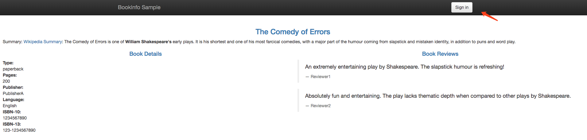

# 2. 基于Bookinfo的流量管理配置

在前面我们成功搭建并部署了`istio`及其其 Bookinfo 示例应用： 


目前搭建 Bookinfo 应用我们只用到了下面两个资源文件：
```shell
samples/bookinfo/platform/kube/bookinfo.yaml
samples/bookinfo/networking/bookinfo-gateway.yaml
```

前者就是通常的`k8s`定义的 Deployment 和 Service 的 yaml 文件，只是在部署时使用`istioctl kube-inject`对这个文件定义的`pod`注入了`sidecar`代理，后者定义了这个应用的外部访问入口`gateway`，以及应用内部 productpage 服务的`VirtualService`规则，而其他内部服务的访问规则还没有被定义。 

可以看到当前集群中的`gateway`:
```shell
$ kubectl get gateway --all-namespaces
NAMESPACE      NAME                              CREATED AT
default        bookinfo-gateway                  7h
istio-system   istio-autogenerated-k8s-ingress   7h
$ istioctl get gateway
GATEWAY NAME       HOSTS     NAMESPACE   AGE
bookinfo-gateway   *         default     1d
```

现在访问应用界面并刷新，会看到 Reviews 有时不会显示评分，有时候会显示不同样式的评分，因为后面有3个不同的Reviews 服务版本，而没有配置该服务的路由规则`route rule`的情况下，该服务的几个实例会被随机访问到，有的版本服务会进一步调用 Ratings 服务，有的不会。

## 不同服务版本访问规则的基本使用
现在我们来对 Reviews 服务添加一条路由规则，启用samples/bookinfo/networking/virtual-service-reviews-v3.yaml 定义的`VirtualService`规则，内容如下：
```yaml
apiVersion: networking.istio.io/v1alpha3
kind: VirtualService
metadata:
  name: reviews
spec:
  hosts:
    - reviews
  http:
  - route:
    - destination:
        host: reviews
        subset: v3
```

这样，所有访问 reviews 服务的流量就会被引导到 reviews 服务对应的 subset 为 v3 的 Pod 中。启用这条规则：
```shell
$ istioctl create -f samples/bookinfo/networking/virtual-service-reviews-v3.yaml
Created config virtual-service/default/reviews at revision 31190097
```

然后查看所有的路由规则：
```shell
$ istioctl get virtualservices
VIRTUAL-SERVICE NAME   GATEWAYS           HOSTS     #HTTP     #TCP      NAMESPACE   AGE
bookinfo               bookinfo-gateway   *             1        0      default     26m
reviews                                   reviews       1        0      default     1m
```

我们可以看到 reviews 的`VirtualService`已经创建成功了，但是此时刷新应用页面，发现访问 Reviews 失败了： 


这是因为我们还没有创建`DestinationRule`，`DestinationRule`将`VirtualService`中指定的`subset`与 pod 的`{labels:{version: v3}}`关联起来。

在 samples/bookinfo/networking/destination-rule-all.yaml 文件中有定义所有该应用中要用到的所有DestinationRule，其中有一段就是对 Reviews 相关的 DestinationRule 的定义:
```yaml
---
apiVersion: networking.istio.io/v1alpha3
kind: DestinationRule
metadata:
  name: reviews
spec:
  host: reviews
  subsets:
  - name: v1
    labels:
      version: v1
  - name: v2
    labels:
      version: v2
  - name: v3
    labels:
      version: v3
```

我们可以看到 DestinationRule 中定义了 subsets 集合，其中 labels 就和我们之前 service 的 labelselector 一样是去匹配 Pod 的 labels 标签的，比如我们这里 subsets 中就包含一个名为 v3 的 subset，而这个 subset 匹配的就是具有 version=v3 这个 label 标签的 Pod 集合，再回到之前的 samples/bookinfo/platform/kube/bookinfo.yaml 文件中，我们可以发现 reviews 的 Deployment 确实有声明不同的 labels->version:
```yaml
---
apiVersion: extensions/v1beta1
kind: Deployment
metadata:
  name: reviews-v3
spec:
  replicas: 1
  template:
    metadata:
      labels:
        app: reviews
        version: v3
    spec:
      containers:
      - name: reviews
        image: istio/examples-bookinfo-reviews-v3:1.8.0
        imagePullPolicy: IfNotPresent
        ports:
        - containerPort: 9080
```

这样我们就通过 DestinationRule 将 VirtualService 与 service 不同的版本关联起来了。

现在我们直接创建 DestinationRule 资源：
```shell
$ istioctl create -f samples/bookinfo/networking/destination-rule-all.yaml
Created config destination-rule/default/productpage at revision 31191609
Created config destination-rule/default/reviews at revision 31191610
Created config destination-rule/default/ratings at revision 31191611
Created config destination-rule/default/details at revision 31191612
```

创建完成后，我们就可以查看目前我们网格中的 DestinationRules:
```shell
$ istioctl get destinationrule
DESTINATION-RULE NAME   HOST          SUBSETS                      NAMESPACE   AGE
details                 details       v1,v2                        default     27s
productpage             productpage   v1                           default     27s
ratings                 ratings       v1,v2,v2-mysql,v2-mysql-vm   default     27s
reviews                 reviews       v1,v2,v3                     default     27s
```

此时再访问应用就成功了，多次刷新页面发现 Reviews 都展示的是 v3 版本带红色星的 Ratings，说明我们VirtualService 的配置成功了。


## 基于权重的服务访问规则使用
刚刚我们演示的基于不同服务版本的服务网格的控制，现在我们来演示下基于权重的服务访问规则的使用。

首先移除刚刚创建的 VirtualService 对象:
```shell
$ istioctl delete virtualservice reviews
Deleted config: virtualservice reviews
$ istioctl get virtualservices
VIRTUAL-SERVICE NAME   GATEWAYS           HOSTS     #HTTP     #TCP      NAMESPACE   AGE
bookinfo               bookinfo-gateway   *             1        0      default     46m
```

现在我们再去访问 Bookinfo 应用又回到最初随机访问 Reviews 的情况了。现在我们查看文件 samples/bookinfo/networking/virtual-service-reviews-80-20.yaml 的定义：
```yaml
apiVersion: networking.istio.io/v1alpha3
kind: VirtualService
metadata:
  name: reviews
spec:
  hosts:
    - reviews
  http:
  - route:
    - destination:
        host: reviews
        subset: v1
      weight: 80
    - destination:
        host: reviews
        subset: v2
      weight: 20
```

这个规则定义了 80% 的对 Reviews 的流量会落入 v1 这个 subset，就是没有 Ratings 的这个服务，20% 会落入 v2 带黑色 Ratings 的这个服务，然后我们创建这个资源对象：
```shell
$ kubectl create -f samples/bookinfo/networking/virtual-service-reviews-80-20.yaml
virtualservice.networking.istio.io "reviews" created
$ istioctl get virtualservices
VIRTUAL-SERVICE NAME   GATEWAYS           HOSTS     #HTTP     #TCP      NAMESPACE   AGE
bookinfo               bookinfo-gateway   *             1        0      default     55m
reviews                                   reviews       1        0      default     24s
```

我们查看当前网格中的 virtualservices 对象，可以看到已经有 reviews 了，证明已经创建成功了，由于上面我们已经将应用中所有的 DestinationRules 都已经创建过了，所以现在我们直接访问应用就可以了，我们多次刷新，可以发现没有出现 Ratings 的次数与出现黑色星 Ratings 的比例大概在4:1左右，并且没有红色星的 Ratings 的情况出现，说明我们配置的 VirtualService 规则生效了。

这就是基于权重的服务访问规则的使用方法。


## 基于请求内容的服务访问规则使用
除了上面基于服务版本和服务权重的方式控制服务访问之外，我们还可以基于请求内容来进行访问控制。

同样，将上面创建的 VirtualService 对象删除：
```shell
$ istioctl delete virtualservice reviews
Deleted config: virtualservice reviews
$ istioctl get virtualservices
VIRTUAL-SERVICE NAME   GATEWAYS           HOSTS     #HTTP     #TCP      NAMESPACE   AGE
bookinfo               bookinfo-gateway   *             1        0      default     46m
```

查看文件 samples/bookinfo/networking/virtual-service-reviews-jason-v2-v3.yaml 的定义：
```yaml
apiVersion: networking.istio.io/v1alpha3
kind: VirtualService
metadata:
  name: reviews
spec:
  hosts:
  - reviews
  http:
  - match:
    - headers:
        end-user:
          exact: jason
    route:
    - destination:
        host: reviews
        subset: v2
  - route:
    - destination:
        host: reviews
        subset: v3
```

这个 VirtualService 对象定义了对 reviews 服务访问的 match 规则。意思是如果当前请求的 header 中包含 jason 这个用户信息，则只会访问到 v2 的 reviews 这个服务版本，即都带星的样式，如果不包含该用户信息，则都直接将流量转发给 v3 这个 reviews 的服务。

我们先不启用这个 VirtualService，现在我们去访问下 Bookinfo 这个应用： 


右上角有登录按钮，在没有登录的情况下刷新页面，reviews 服务是被随机访问的，可以看到有带星不带星的样式，点击登录，在弹窗中 User Name 输入 jason，Password为空，登录： 


再刷新页面，可以看到跟未登录前的访问规则一样，也是随机的。

现在我们来创建上面的 VirtualService 这个对象:
```shell
$ kubectl create -f samples/bookinfo/networking/virtual-service-reviews-jason-v2-v3.yaml
virtualservice.networking.istio.io "reviews" created
$ istioctl get virtualservice
VIRTUAL-SERVICE NAME   GATEWAYS           HOSTS     #HTTP     #TCP      NAMESPACE   AGE
bookinfo               bookinfo-gateway   *             1        0      default     1h
reviews                                   reviews       2        0      default     47s
```

此时再回去刷新页面，发现一直都是黑星的 Reviews 版本(v2)被访问到了。 注销退出后再访问，此时又一直是红色星的版本(v3)被访问了。 

说明我们基于 headers->end-user->exact:jason 的控制规则生效了。在 productpage 服务调用 reviews 服务时，登录的情况下会在 header 中带上用户信息，通过 exact 规则匹配到相关信息后，流量被引向了上面配置的v2版本中。

这里要说明一下match的匹配规则：
```
All conditions inside a single match block have AND semantics, while the list of match blocks have OR semantics. The rule is matched if any one of the match blocks succeed.
```

意思是一个 match 块里的条件是需要同时满足才算匹配成功的，如:
```yaml
- match:
    - uri:
        prefix: "/wpcatalog"
      port: 443
```

多个 match 块之间是只要有一个 match 匹配成功了，就会走向它指定的服务版本去，而忽略其他的。我们的示例中在登录的条件下，满足第一个 match，所以服务一直会访问到 v2 版本。退出登录后，没有 match 规则满足匹配，会走向最后一个 route 规则，即 v3 版本。


到这里，我们就和大家一起学习了基于不同服务版本、权重以及请求内容来控制服务流量的配置，后面我们将进一步学习流量管理的其他用法。
