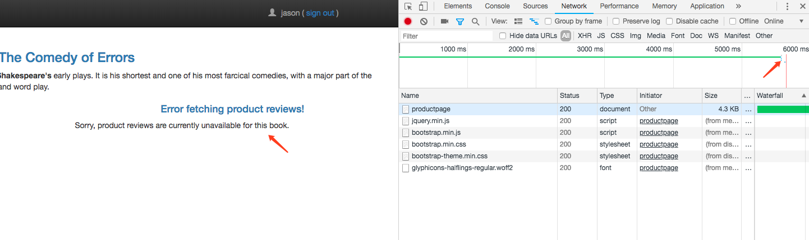
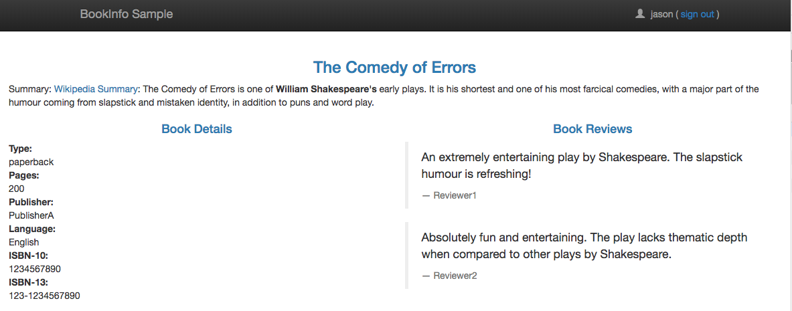
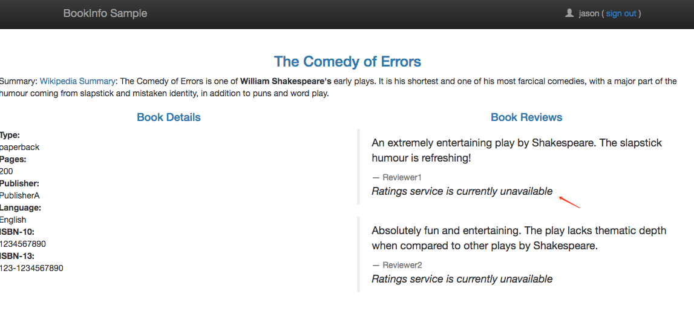
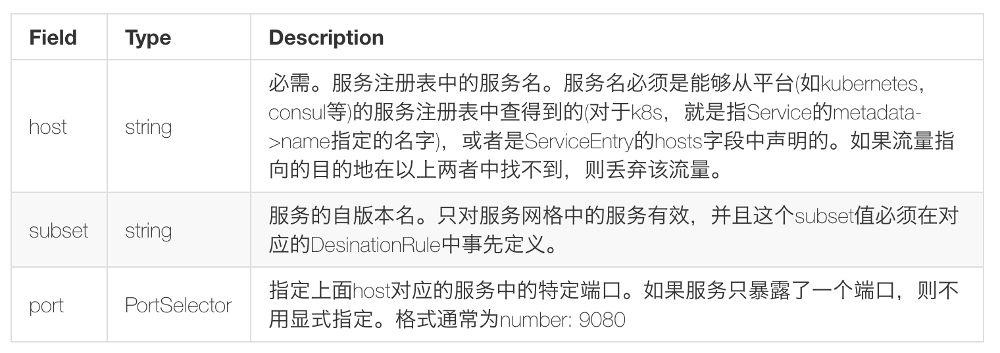
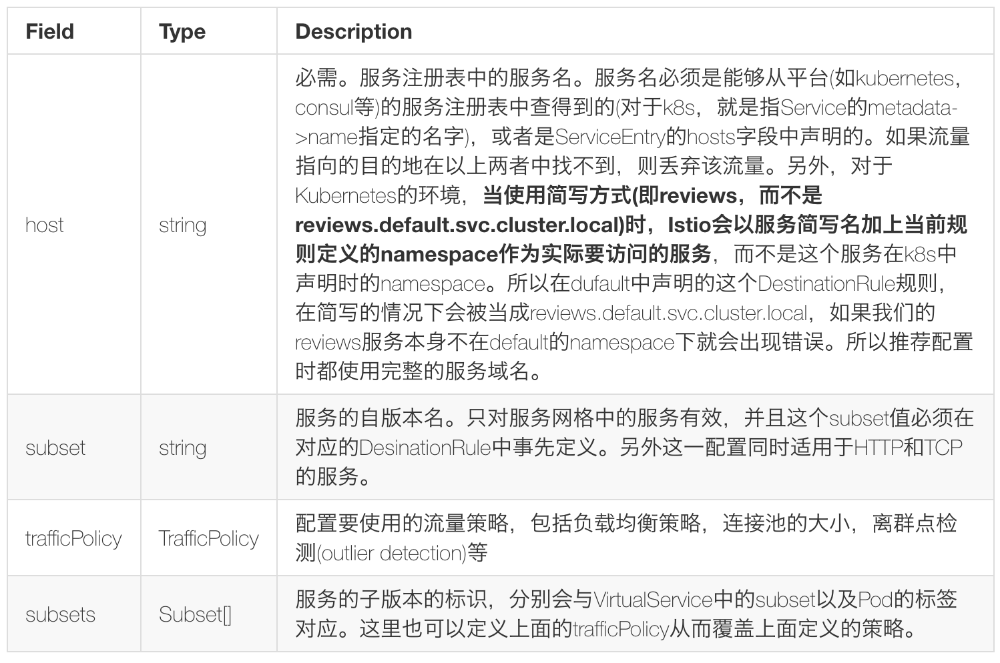

# 3. 基于Bookinfo的流量管理配置2

上节课我们和大家一起学习了基于不同服务版本、权重以及请求内容来控制服务流量的配置，这节课我们继续和大家学习流量控制的其他方法。

## 延迟访问故障注入
接上节课的内容，第一步还是需要移除之前创建的 VirtualService:
```shell
$ istioctl delete virtualservice reviews
Deleted config: virtualservice reviews
$ istioctl get virtualservice
VIRTUAL-SERVICE NAME   GATEWAYS           HOSTS     #HTTP     #TCP      NAMESPACE   AGE
bookinfo               bookinfo-gateway   *             1        0      default     6d
```

然后我们查看 istio 样例文件夹下面的文件：samples/bookinfo/networking/virtual-service-ratings-test-delay.yaml 的内容
```yaml
apiVersion: networking.istio.io/v1alpha3
kind: VirtualService
metadata:
  name: ratings
spec:
  hosts:
  - ratings
  http:
  - match:
    - headers:
        end-user:
          exact: jason
    fault:
      delay:
        percent: 100
        fixedDelay: 7s
    route:
    - destination:
        host: ratings
        subset: v1
  - route:
    - destination:
        host: ratings
        subset: v1
```

这个 VirtualService 定义了一个在 jason 登录的情况下，访问 ratings 服务的 100% 的 7s 访问延迟。前面我们知道，Bookinfo 这个示例 productpage 服务调用 reviews，reviews 的不同版本会对 ratings 进行不同的调用，其中 reviews-v1 不调用 ratings，reviews-v2 和 reviews-v3 会调用 ratings，并做不同样式的渲染。并且在 productpage 访问 reviews 时，代码中有硬编码 6s 中的访问超时限制，而 reviews 访问 ratings 编码了 10s 的访问超时限制。

了解这一点后，我们现在来创建这个 VirtualService 资源对象：
```shell
$ kubectl create -f  samples/bookinfo/networking/virtual-service-ratings-test-delay.yaml
virtualservice.networking.istio.io "ratings" created
$ istioctl get virtualservice
VIRTUAL-SERVICE NAME   GATEWAYS           HOSTS     #HTTP     #TCP      NAMESPACE   AGE
bookinfo               bookinfo-gateway   *             1        0      default     6d
ratings                                   ratings       2        0      default     49s
```

创建完成后，前往 Bookinfo 应用，登录 jason，打开浏览器的`Network`，刷新页面，发现请求加载很慢，大约 6s 后，出现如下界面： 


看到 productpage 的请求大约耗时 6s，Reviews显示 unavailable 的错误。因为此时 reviews 请求 ratings 的访问超过了 6s 还没有响应，使得 productpage 中的硬编码的超时设置生效了。

当然有的时候我们也能成功访问到 reviews-v1 版本，因为此时并没有进一步访问 ratings 服务，所以一切都是正常的，会显示不带星的界面： 


通过这种**超时故障注入**，可以帮助我们方便地发现服务间相互访问中存在的潜在问题。


## 中断访问故障注入
同样移除刚才的 VirutualService 资源对象：
```shell
$ istioctl delete virtualservice ratings
Deleted config: virtualservice ratings
$ istioctl get virtualservice
VIRTUAL-SERVICE NAME   GATEWAYS           HOSTS     #HTTP     #TCP      NAMESPACE   AGE
bookinfo               bookinfo-gateway   *             1        0      default     6d
```

然后我们查看 istio 样例文件夹下面的文件：samples/bookinfo/networking/virtual-service-ratings-test-abort.yaml 的内容
```yaml
apiVersion: networking.istio.io/v1alpha3
kind: VirtualService
metadata:
  name: ratings
spec:
  hosts:
  - ratings
  http:
  - match:
    - headers:
        end-user:
          exact: jason
    fault:
      abort:
        percent: 100
        httpStatus: 500
    route:
    - destination:
        host: ratings
        subset: v1
  - route:
    - destination:
        host: ratings
        subset: v1
```

通过上面的这个 yaml 文件我们可以看出这个 VirtualService 资源对象配置了在 jason 登录时，reviews 对 ratings 访问时 100% 的返回一个`500`错误响应。

然后同样创建这个资源对象：(用 kubectl 或者 istioctl 工具都是可以的)
```yaml
$ istioctl create -f samples/bookinfo/networking/virtual-service-ratings-test-abort.yaml
Created config virtual-service/default/ratings at revision 32143909
$ istioctl get virtualservice
VIRTUAL-SERVICE NAME   GATEWAYS           HOSTS     #HTTP     #TCP      NAMESPACE   AGE
bookinfo               bookinfo-gateway   *             1        0      default     6d
ratings                                   ratings       2        0      default     4s
```

现在我们回到 BookInfo 应用，登录 jason，刷新页面，可以看到下面的现象： 


我们可以看到 reviews 对 ratings 的访问失败了，服务上面我们 VirtualService 资源对象的配置。


## 不同环境服务访问
使用 istio 的路由规则管理，还可以配置对不同环境(prod, staging, dev等)的同一服务的访问规则。由于我的实验环境没有搭建多环境的集群，这里指使用官方的demo来做描述。
```yaml
apiVersion: networking.istio.io/v1alpha3
kind: VirtualService
metadata:
  name: my-productpage-rule
  namespace: istio-system
spec:
  hosts:
  - productpage.prod.svc.cluster.local # ignores rule namespace
  http:
  - timeout: 5s
    route:
    - destination:
        host: productpage.prod.svc.cluster.local
```

通常在一个集群中如果搭建多环境的情况可以使用`namespace`来进行划分，而使用上面的方式就可以实现对其他 namepaces 的服务的访问。 

上面的 VirtualService 对象定义了对 namespace 为 prod 中的 productpage 服务的访问，会在 5s 的 timeout 后才会调用该服务。这个访问规则没有定义 subset，istio 会获取productpage.prod.svc.cluster.local 服务对应的所有实例并向其他服务实例注入这些实例的信息到他们的 load balancing pool 中去。 

同时注意这个 VirtualService 是定义在 istio-system 的namespace中的，此时要使用完整的服务域名：productpage.prod.svc.cluster.local，这样这条规则所属的 namespace 才会解析到其他 namespace 的服务。


## 服务网格外的流量管理
为了控制服务网格外的服务的流量访问，外部的服务必须首先使用一个`ServiceEntry`对象加入到 istio 的内部 service registry 中，服务网格才会知道如何导向这些外部服务的流量。

为了测试这个功能，我们使用 istio 样例中的 sleep 应用来验证改功能，查看 samples/sleep/sleep.yaml 文件内容：
```yaml
apiVersion: v1
kind: Service
metadata:
  name: sleep
  labels:
    app: sleep
spec:
  ports:
  - port: 80
    name: http
  selector:
    app: sleep
---
apiVersion: extensions/v1beta1
kind: Deployment
metadata:
  name: sleep
spec:
  replicas: 1
  template:
    metadata:
      labels:
        app: sleep
    spec:
      containers:
      - name: sleep
        image: tutum/curl
        command: ["/bin/sleep","infinity"]
        imagePullPolicy: IfNotPresent
---
```

这其实就是一个简单的应用，通过 Deployment 进行控制，通过 Service 暴露服务，现在我们来部署该应用：
```yaml
$ kubectl apply -f <(istioctl kube-inject -f samples/sleep/sleep.yaml)
service "sleep" created
deployment.extensions "sleep" created
```

待应用部署完成后，我们进入该应用容器内部执行一些测试操作：
```shell
$ export SLEEP_POD=$(kubectl get pod -l app=sleep -o jsonpath={.items..metadata.name})
$ kubectl exec -it $SLEEP_POD -c sleep -- curl -sL -o /dev/null -D - http://edition.cnn.com/politics
HTTP/1.1 404 Not Found
date: Mon, 15 Oct 2018 17:30:13 GMT
server: envoy
content-length: 0

```

可以看到会返回上面的`404`的信息，因为该域名不在当前的服务网格中，默认情况下 istio 不允许访问服务网格外部的 URL，即服务网格中对未知的服务请求会被丢弃。这就需要我们来创建一个 ServiceEntry 对象，将外部的访问服务引入到服务网格中来。

例如下面的规则定义了一个访问 edition.cnn.com 的服务的 ServiceEntry:（cnn-service-entry.yaml）
```yaml
apiVersion: networking.istio.io/v1alpha3
kind: ServiceEntry
metadata:
  name: cnn
spec:
  hosts:
  - edition.cnn.com
  ports:
  - number: 80
    name: http-port
    protocol: HTTP
  - number: 443
    name: https
    protocol: HTTPS
  resolution: DNS
```

现在我们来部署上面的 ServiceEntry 资源：
```shell
$ istioctl create -f cnn-service-entry.yaml
Created config service-entry/default/cnn at revision 32149308
$ istioctl get serviceentry
SERVICE-ENTRY NAME   HOSTS             PORTS               NAMESPACE   AGE
cnn                  edition.cnn.com   HTTP/80,HTTPS/443   default     1m
```

现在我们再去上面的 sleep 容器中执行上面的测试请求：
```shell
$ kubectl exec -it $SLEEP_POD -c sleep -- curl -sL -o /dev/null -D - http://edition.cnn.com/politics
HTTP/1.1 301 Moved Permanently
server: envoy
retry-after: 0
content-length: 0
cache-control: public, max-age=600
location: https://edition.cnn.com/politics
accept-ranges: bytes
date: Mon, 15 Oct 2018 17:31:49 GMT
via: 1.1 varnish
set-cookie: countryCode=CN; Domain=.cnn.com; Path=/
set-cookie: geoData=beijing|BJ|100000|CN|AS; Domain=.cnn.com; Path=/
x-served-by: cache-nrt6143-NRT
x-cache: HIT
x-cache-hits: 0
x-envoy-upstream-service-time: 418

HTTP/1.1 200 OK
Content-Type: text/html; charset=utf-8
x-servedByHost: ::ffff:172.17.20.12
access-control-allow-origin: *
cache-control: max-age=60
content-security-policy: default-src 'self' blob: https://*.cnn.com:* http://*.cnn.com:* *.cnn.io:* *.cnn.net:* *.turner.com:* *.turner.io:* *.ugdturner.com:* courageousstudio.com *.vgtf.net:*; script-src 'unsafe-eval' 'unsafe-inline' 'self' *; style-src 'unsafe-inline' 'self' blob: *; child-src 'self' blob: *; frame-src 'self' *; object-src 'self' *; img-src 'self' data: blob: *; media-src 'self' data: blob: *; font-src 'self' data: *; connect-src 'self' *; frame-ancestors 'self' https://*.cnn.com:* http://*.cnn.com https://*.cnn.io:* http://*.cnn.io:* *.turner.com:* courageousstudio.com;
x-content-type-options: nosniff
x-xss-protection: 1; mode=block
Via: 1.1 varnish
Content-Length: 1704385
Accept-Ranges: bytes
Date: Mon, 15 Oct 2018 09:31:53 GMT
Via: 1.1 varnish
Age: 402
Connection: keep-alive
Set-Cookie: countryCode=CN; Domain=.cnn.com; Path=/
Set-Cookie: geoData=beijing|BJ|100000|CN|AS; Domain=.cnn.com; Path=/
Set-Cookie: tryThing00=1284; Domain=.cnn.com; Path=/; Expires=Mon Jul 01 2019 00:00:00 GMT
Set-Cookie: tryThing01=8877; Domain=.cnn.com; Path=/; Expires=Fri Mar 01 2019 00:00:00 GMT
Set-Cookie: tryThing02=9979; Domain=.cnn.com; Path=/; Expires=Wed Jan 01 2020 00:00:00 GMT
X-Served-By: cache-iad2129-IAD, cache-hnd18720-HND
X-Cache: HIT, HIT
X-Cache-Hits: 2, 1
X-Timer: S1539595913.083337,VS0,VE5
Vary: Accept-Encoding

```

现在我们发现可以正常返回内容了，返回`200`，证明请求成功了。 

> 说明：`-L`让 curl 跟随连接进行重定向。这里服务器直接返回的 301 重定向响应，要求客户端再使用`HTTPS`的方式对 https://edition.cnn.com/politics 地址进行访问，第二次访问才返回了`200`的成功码。

除此之外，我们还可以进一步配置`egress gateway`，使这些对外部的流量访问经由`egress`去到外部。

现在我们在 istio 中定义一个`egress gateway`对象来注册允许从服务网格出去的服务，创建一个用于edition.cnn.com 的 egress gateway 对象:(cnn-egress-gateway.yaml)
```yaml
apiVersion: networking.istio.io/v1alpha3
kind: Gateway
metadata:
  name: istio-egressgateway
spec:
  selector:
    istio: egressgateway
  servers:
  - port:
      number: 80
      name: http
      protocol: HTTP
    hosts:
    - edition.cnn.com
```

除了上面的 engress gateway 对象之外，我们还需要创建 VirtualService 和 DestinationRule 这两个资源对象:（cnn-virtual-rule.yaml）
```yaml
apiVersion: networking.istio.io/v1alpha3
kind: VirtualService
metadata:
  name: direct-cnn-through-egress-gateway
spec:
  hosts:
  - edition.cnn.com
  gateways:
  - istio-egressgateway
  - mesh
  http:
  - match:
    - gateways:
      - mesh
      port: 80
    route:
    - destination:
        host: istio-egressgateway.istio-system.svc.cluster.local
        subset: cnn
        port:
          number: 80
      weight: 100
  - match:
    - gateways:
      - istio-egressgateway
      port: 80
    route:
    - destination:
        host: edition.cnn.com
        port:
          number: 80
      weight: 100

---
apiVersion: networking.istio.io/v1alpha3
kind: DestinationRule
metadata:
  name: egressgateway-for-cnn
spec:
  host: istio-egressgateway.istio-system.svc.cluster.local
  subsets:
  - name: cnn
```

然后创建上面3个资源对象：
```shell
$ istioctl create -f cnn-virtual-rule.yaml
Created config virtual-service/default/direct-cnn-through-egress-gateway at revision 32149507
Created config destination-rule/default/egressgateway-for-cnn at revision 32149508
$ istioctl create -f cnn-egress-gateway.yaml
Created config gateway/default/istio-egressgateway at revision 32149519
```

创建完成后，现在我们再去 sleep 容器执行下上面的请求：
```shell
$ kubectl exec -it $SLEEP_POD -c sleep -- curl -sL -o /dev/null -D - http://edition.cnn.com/politics
HTTP/1.1 301 Moved Permanently
server: envoy
retry-after: 0
content-length: 0
cache-control: public, max-age=600
location: https://edition.cnn.com/politics
accept-ranges: bytes
date: Mon, 15 Oct 2018 17:33:57 GMT
via: 1.1 varnish
set-cookie: countryCode=CN; Domain=.cnn.com; Path=/
set-cookie: geoData=beijing|BJ|100000|CN|AS; Domain=.cnn.com; Path=/
x-served-by: cache-nrt6151-NRT
x-cache: HIT
x-cache-hits: 0
x-envoy-upstream-service-time: 439

HTTP/1.1 200 OK
Content-Type: text/html; charset=utf-8
x-servedByHost: ::ffff:172.17.25.25
access-control-allow-origin: *
cache-control: max-age=60
content-security-policy: default-src 'self' blob: https://*.cnn.com:* http://*.cnn.com:* *.cnn.io:* *.cnn.net:* *.turner.com:* *.turner.io:* *.ugdturner.com:* courageousstudio.com *.vgtf.net:*; script-src 'unsafe-eval' 'unsafe-inline' 'self' *; style-src 'unsafe-inline' 'self' blob: *; child-src 'self' blob: *; frame-src 'self' *; object-src 'self' *; img-src 'self' data: blob: *; media-src 'self' data: blob: *; font-src 'self' data: *; connect-src 'self' *; frame-ancestors 'self' https://*.cnn.com:* http://*.cnn.com https://*.cnn.io:* http://*.cnn.io:* *.turner.com:* courageousstudio.com;
x-content-type-options: nosniff
x-xss-protection: 1; mode=block
Via: 1.1 varnish
Content-Length: 1704385
Accept-Ranges: bytes
Date: Mon, 15 Oct 2018 09:34:01 GMT
Via: 1.1 varnish
Age: 127
Connection: keep-alive
Set-Cookie: countryCode=CN; Domain=.cnn.com; Path=/
Set-Cookie: geoData=beijing|BJ|100000|CN|AS; Domain=.cnn.com; Path=/
Set-Cookie: tryThing00=6048; Domain=.cnn.com; Path=/; Expires=Mon Jul 01 2019 00:00:00 GMT
Set-Cookie: tryThing01=0013; Domain=.cnn.com; Path=/; Expires=Fri Mar 01 2019 00:00:00 GMT
Set-Cookie: tryThing02=9990; Domain=.cnn.com; Path=/; Expires=Wed Jan 01 2020 00:00:00 GMT
X-Served-By: cache-iad2127-IAD, cache-tyo19949-TYO
X-Cache: HIT, MISS
X-Cache-Hits: 1, 0
X-Timer: S1539596041.954017,VS0,VE471
Vary: Accept-Encoding

```

现在我们发现可以正常返回内容，这时我们去查看`egressgateway`的 Pod 中的容器日志：
```shell
$ kubectl logs $(kubectl get pod -l istio=egressgateway -n istio-system -o jsonpath='{.items[0].metadata.name}') -n istio-system | tail
......
[2018-10-15T17:33:57.261Z] "GET /politics HTTP/2" 301 - 0 0 437 429 "10.244.4.206" "curl/7.35.0" "6d4f2ac3-0957-97a5-961a-241c7fd72536" "edition.cnn.com" "151.101.129.67:80"
......
```

可以看到有一条上面的 GET /politics 的日志信息，说明访问经过了 egress gateway 出去了。


## 规则说明
最后简单总结下 VirtualService 和 DestinationRule 的一些配置规则。

VirtualService 的配置规则说明:



DestinationRule 的配置规则说明：



到这里我们就把基于 BookInfo 示例的流量控制管理的配置和大家讲解完了。
